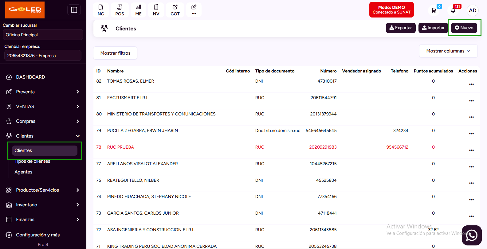
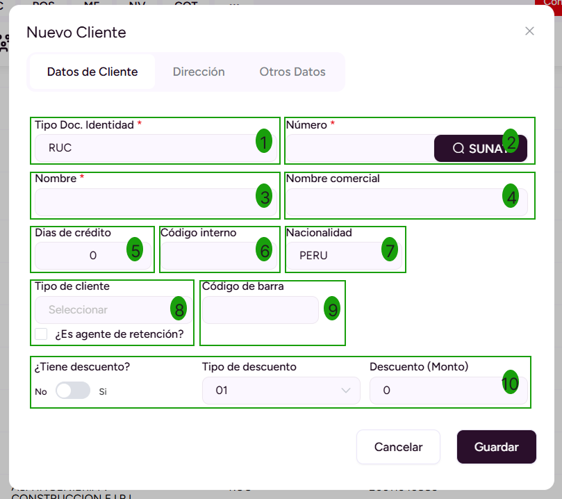
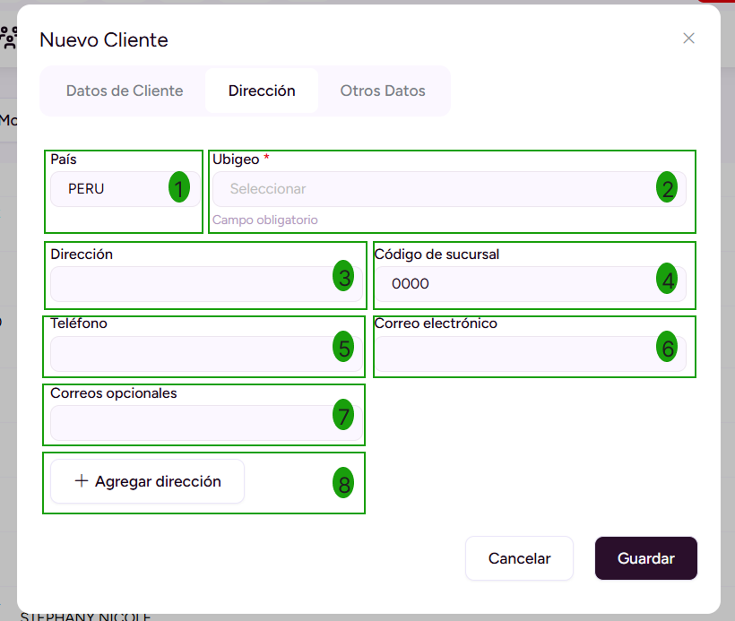
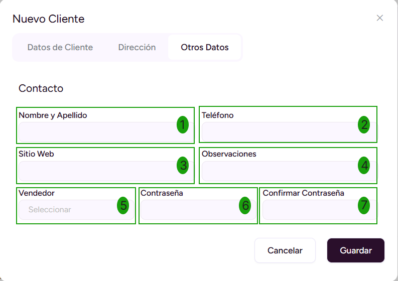

# Creación Individual

En esta área te ayudaremos a cómo crear clientes de forma individual. Sigue estos pasos para realizarlo:

## Crear nuevo cliente

Ingresa al módulo de **Clientes** y luego selecciona subcategoría **Clientes.**

En la parte superior derecha selecciona el botón **Nuevo.**

## Datos de cliente

Posteriormente aparecerá el formulario para llenar los datos del **Nuevo Cliente.**

Se completarán los siguientes datos:

1. **Tipo Doc Identidad:** Selecciona RUC,DNI,CE,etc.
2. **Número:** Ingresa el número que corresponde al tipo de documento Identidad. Después selecciona el botón SUNAT, para que se autocomplete el nombre y la dirección.
3. **Nombre:** Se autocompletará el nombre que corresponde al tipo de documento Identidad.
4. **Nombre comercial:** Ingresa la denominación que identifica a la empresa.
5. **Días de crédito**
6. **Código Interno:** Ingresa el código del cliente.
7. **Nacionalidad:** Selecciona la nacionalidad del cliente.
8. **Tipo de cliente:** Ingresa la clasificación de su cliente, para conocer cómo crearlo, te invitamos a leer nuestro **[artículo](https://manual.pro8.uio.la/modulos/Esenciales/clientes/Configurar-tipos-de-clientes)**.
9. **Código de barra:** Ingresa el código de barra del cliente.
10. **Descuento:** Ingresa el descuento que se le aplicará al cliente, se divide en 3 opciones Tiene descuento? Tipo de Descuento y Descuento (Monto).

:::info IMPORTANTE:
Tener en cuenta los siguientes puntos: [artículo](https://manual.pro8.uio.la/guias-adicionales/APIDesarrollo/Consulta-Api)

:::

## Dirección

Se completarán los siguientes datos:

1. **País:** Ingresa el país.
2. **Ubigeo:** Ingresa el ubigeo.
3. **Direccion:** Ingresa la dirección.
4. **Codigo de sucursal:** Ingresa el código de sucursal.
5. **Teléfono:** Ingresa teléfono de contacto.
6. **Correo electrónico:** Ingresa el correo electrónico principal.
7. **Correos Opcionales:** Ingresa correos adicionales.
8. **+ Agregar Direccion:** Ingresa otra dirección.

## Otros datos

En esta sección se colocarán los datos de el personal encargado, es opcional.

Se completarán los siguientes datos:

1. **Nombre y Apellido:** Ingresa los datos personales.
2. **Teléfono:** Ingresa número celular.
3. **Sitio Web:** Ingresa página web.
4. **Observaciones:** Ingresa detalle o especificaciones importantes.
5. **Vendedor:** Ingresa el vendedor de la empresa.
6. **Contraseña:** Ingresa la contraseña.
7. **Confirmar Contraseña:** Ingresa la contraseña.

Posteriormente selecciona el botón **Guardar** y se visualizará la lista de los clientes generados.
