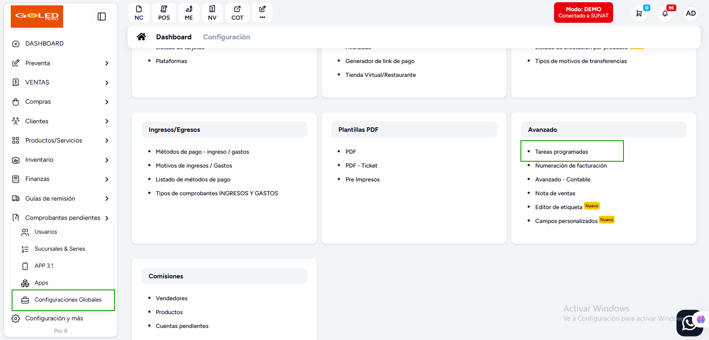
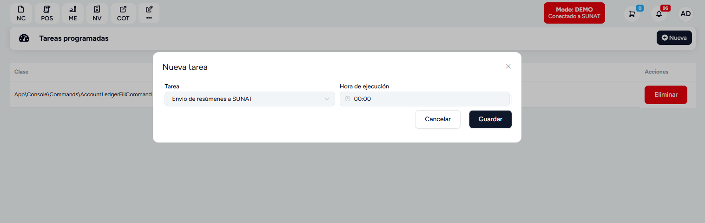
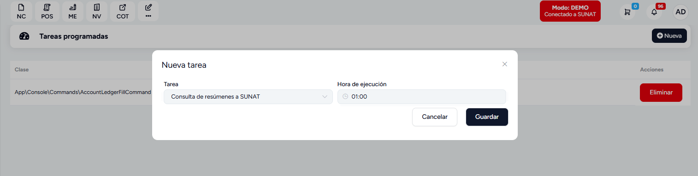

# Envio de Boletas automatico

::alert{type="info"}

Esta es una guía para programar el envío de boletas a SUNAT.

::

## ¿Qué es el envío de Boletas automatico?

El envío de boletas automatico es una funcionalidad que permite enviar boletas a SUNAT de forma automática.

## ¿Cómo programar el envío de Boletas automatico?

1. Ir a **Configuración** -> **Configuración Globales** -> **Avanzado** -> **Tareas Programadas**

2. Hacer clic en **Agregar**
3. Seleccionar **Envío de resúmenes a SUNAT**

4. Configurar los parámetros (Tarea y hora)
5. Hacer clic en **Guardar**

6. Configurar **Consulta de Resumenes**

7. Configurar los parámetros (Tarea y hora)
8. Hacer clic en **Guardar**

::alert{type="warning"}

**Nota:** Se recomienda programar el envío de boletas en horarios fuera de pico para evitar errores, se recomienda que sea en horarios de madrugada 12 am a 5am.

::
