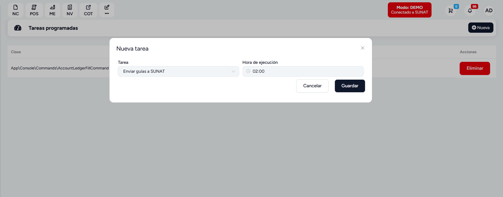

# Envio de Guías de Remisión automatico

::alert{type="info"}

Esta es una guía para programar el envío de guías de remisión a SUNAT.

::

## ¿Qué es el envío de Guías de Remisión automatico?

El envío de guías de remisión automatico es una funcionalidad que permite enviar guías de remisión a SUNAT de forma automática.

## ¿Cómo programar el envío de Guías de Remisión automatico?

1. Ir a **Configuración** -> **Configuración Globales** -> **Avanzado** -> **Tareas Programadas**

2. Hacer clic en **Agregar**
3. Seleccionar **Envio de Guías de Remisión automatico**

4. Configurar los parámetros (Tarea y hora)
5. Hacer clic en **Guardar**

::alert{type="warning"}

**Nota:** Se recomienda programar el envío de guías de remisión en horarios fuera de pico para evitar errores.

::
