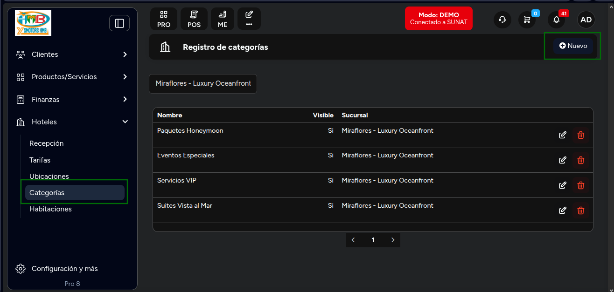
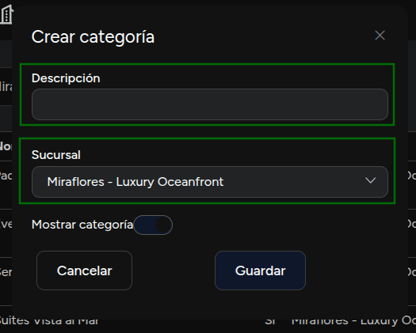
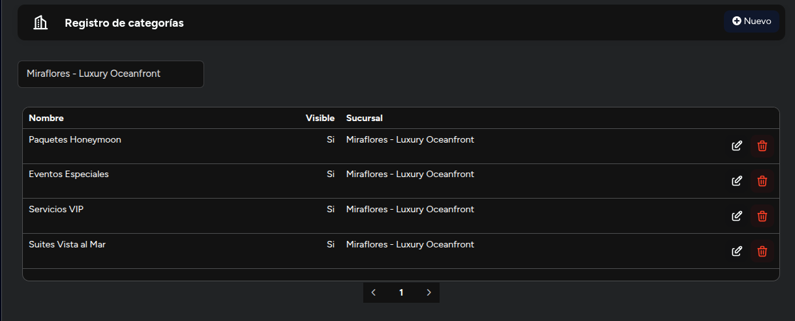

# Categorías

En este artículo te enseñaremos a como crear categorías para las habitaciones. Sigue estos pasos para realizarlo:

Ingresa al módulo de **Hoteles** y luego selecciona la subcategoría **Categorías**.

## Crear categorías

En la parte superior derecha selecciona el botón **Nuevo**. Aparecerá el siguiente formulario:

Completa:

1. **Descripción:** Inserta la descripción de la categoría.
2. **Sucursal:** Selecciona la sucursal, donde se aplicará la categoría.
3. **Estado:** Selecciona el interruptor si desea mostrar la categoría. Por defecto estará activa.

Seguido selecciona el botón **Guardar**.

Se mostrará el listado de categorías:

Podrá editar la categoría, seleccionando el icono del lápiz, y eliminarla con el icono de la papelera.
