# Recepción

En este manual, te mostraremos cómo abrir una habitación, registrar huéspedes y gestionar consumos paso a paso.

1️⃣ Iniciar check-in
Nos ubicamos en el módulo Recepción 🛎️

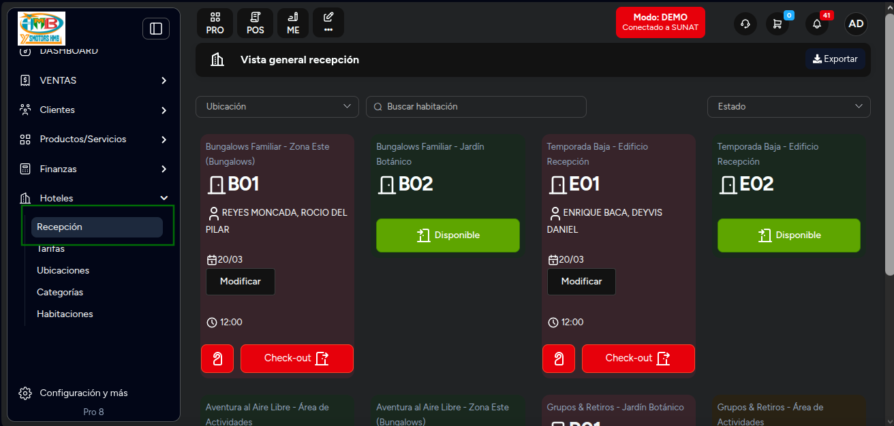

Seleccionamos una habitación disponible
Y hacemos clic en Disponible para iniciar el check-in.

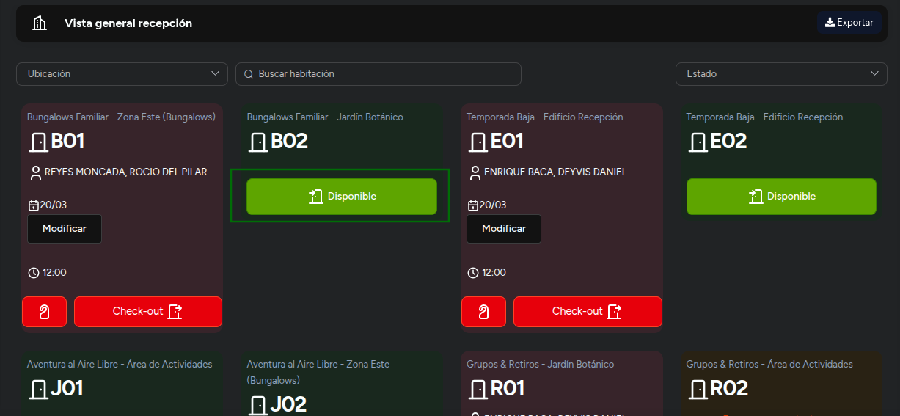

2️⃣ Configurar la estadía

1. Seleccionamos:

- Tarifa de la habitación

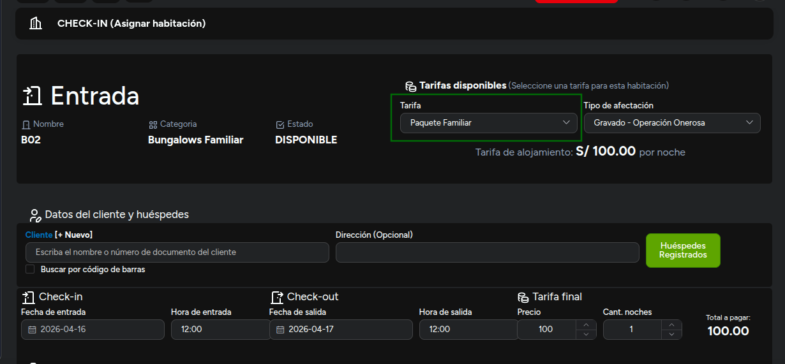

- Cliente

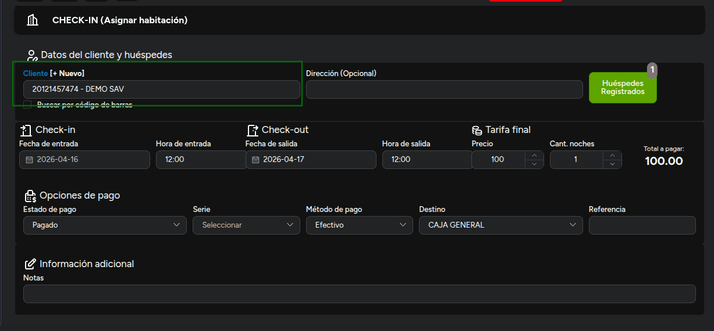

- Si el huésped tiene acompañantes 👇
  - Haz clic en Huéspedes registrados

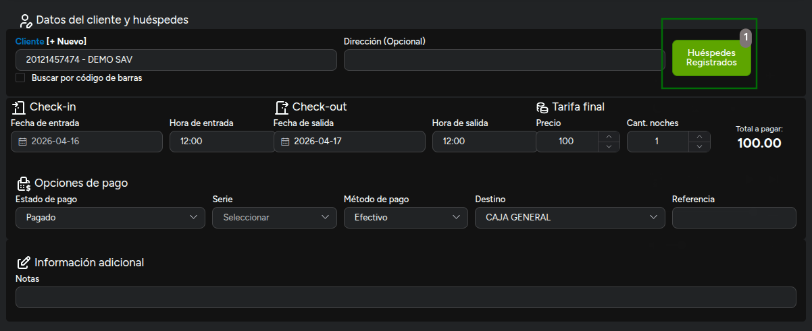

  - Agregar

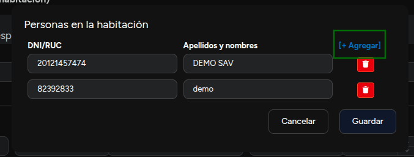

  - Puedes ingresar DNI o RUC
  - Si el documento es válido, el sistema consulta automáticamente

🔹 Para este ejemplo usaremos un dato aleatorio
Luego indicamos la cantidad de noches.

3️⃣ Definir forma de pago
Aquí tenemos dos escenarios 👇

💰 Pagado:

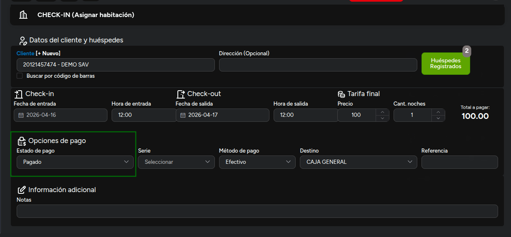

Se generará una nota de venta (solo este tipo en check-in)
Se solicitará la serie correspondiente

⏳ Pendiente de pago:

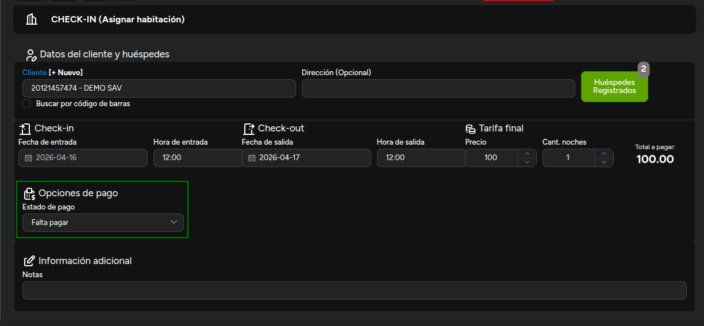

No se genera comprobante en este momento
Se generará recién en el check-out

4️⃣ Confirmar check-in
Guardamos la operación ✅
El sistema mostrará la nota de venta generada (si fue pagado).

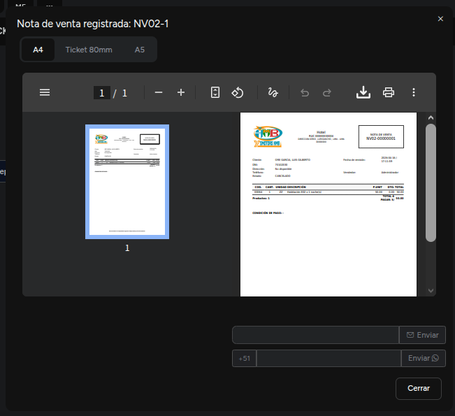

Al volver a recepción:
🔴 La habitación cambia a estado Ocupada (color rojo)

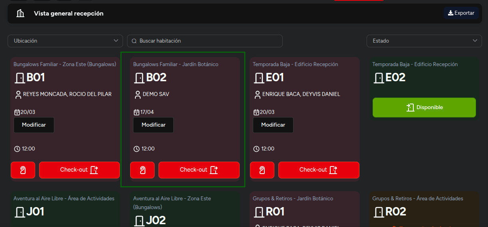

5️⃣ Agregar consumos a la habitación

Desde la habitación, podemos:

## Modificar la estadía

### Agregar productos o servicios

Al agregar un producto:

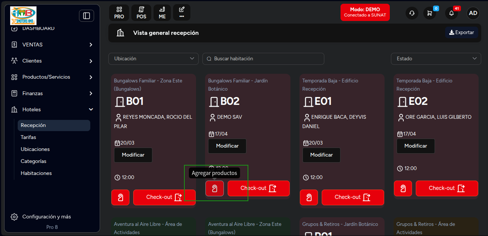

💰 Si se paga en el momento:

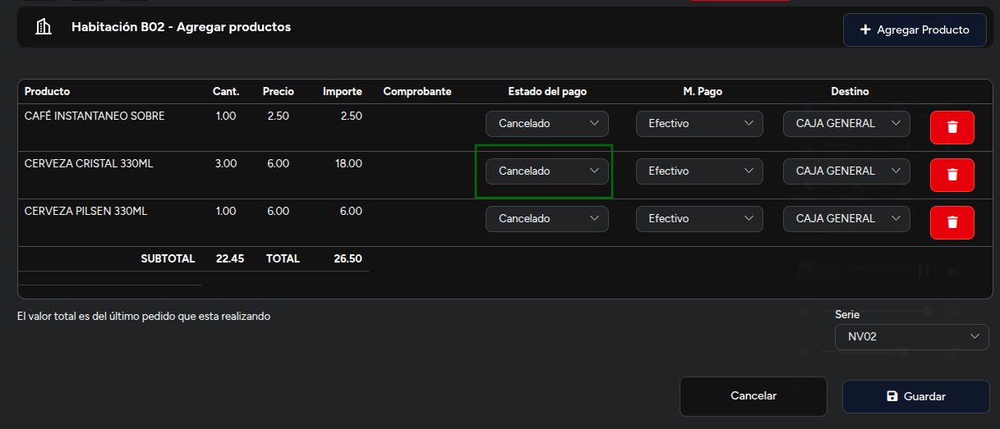

El estado del pago estará **Cancelado**

Se genera una nota de venta

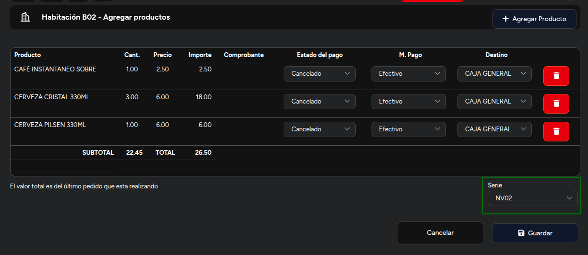

🧾 Si se carga a la habitación:

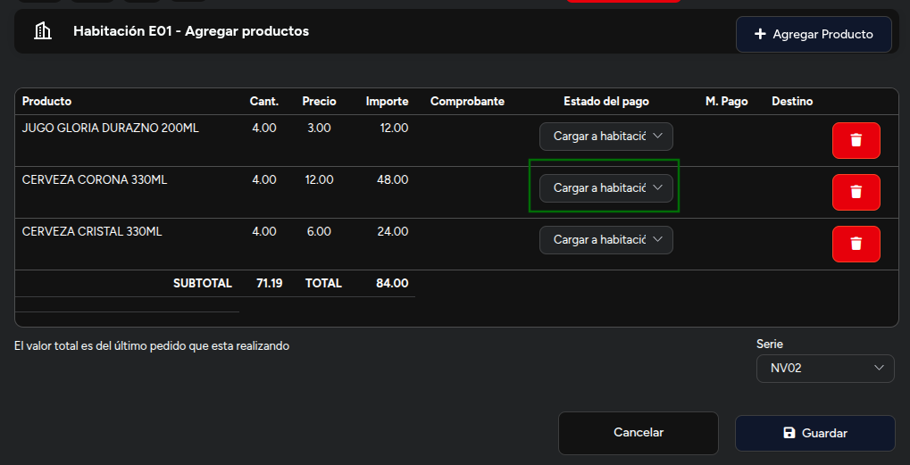

No se genera comprobante aún.

Se acumula para el check-out

6️⃣ Finalizar y revisar
Guardamos y el sistema mostrará la nota de venta generada (si aplica).

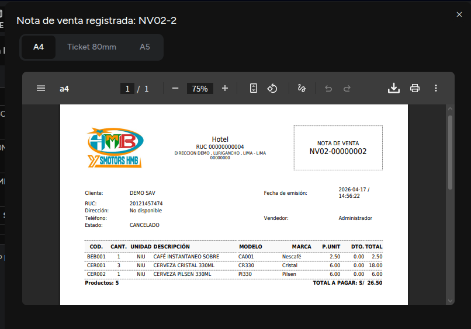

Volvemos a recepción.

7️⃣ Realizar check-out
Seleccionamos el botón Check-out

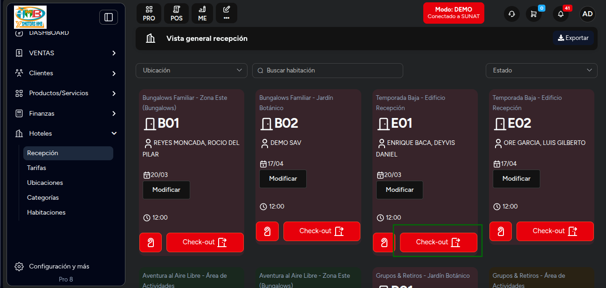

Aquí veremos:

1. Productos pagados
2. Consumos pendientes

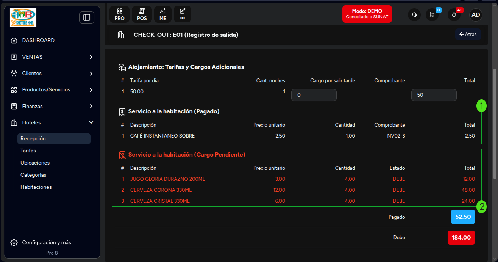

3. Monto total pagado
4. Monto pendiente

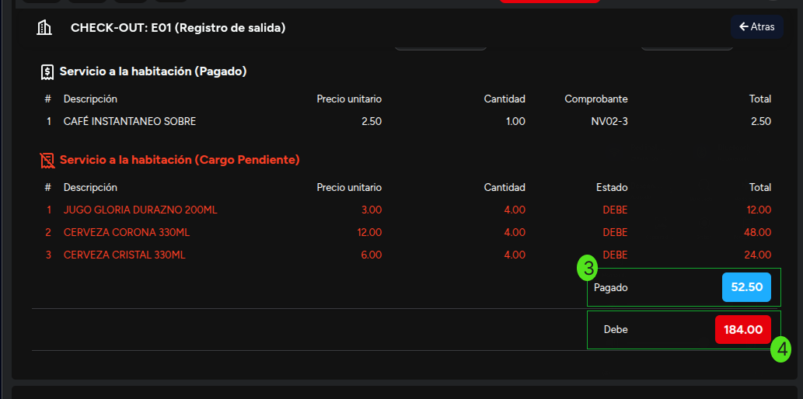

8️⃣ Generar comprobante final
Para los pendientes, podemos emitir:
✅ Nota de venta
✅ Boleta
✅ Factura

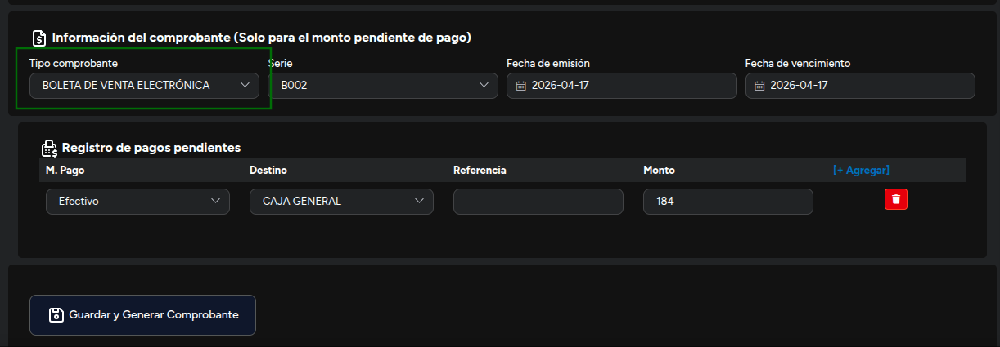

::danger
La emision de la **factura o boleta** va a depender del **docuemnto de identidad del cliente** siendo **DNI para boleta y RUC para factura.**

:::

Seleccionamos el tipo de comprobante y finalizamos.

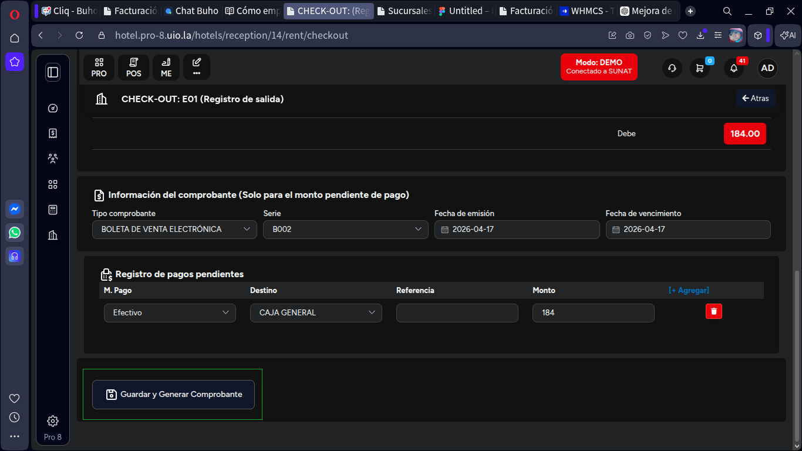

9️⃣ Estado final de la habitación
Después del check-out:
🧹 La habitación pasa a estado **Limpieza**, representado con el color **Azul**

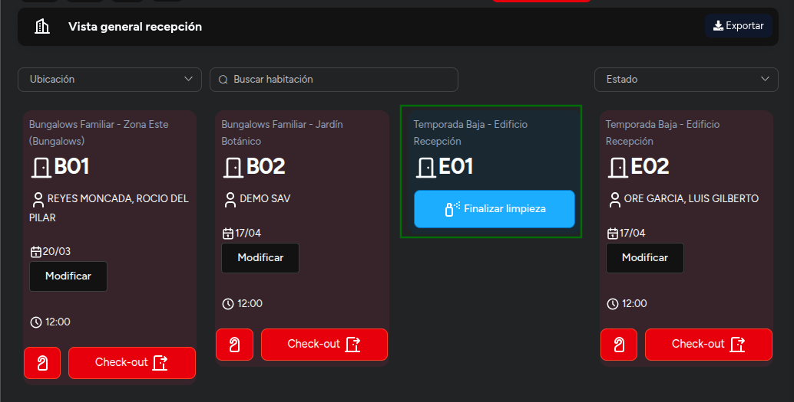

Y luego volverá a **Disponible**, despues de hacer click en el boton **Finalizar Limpieza**

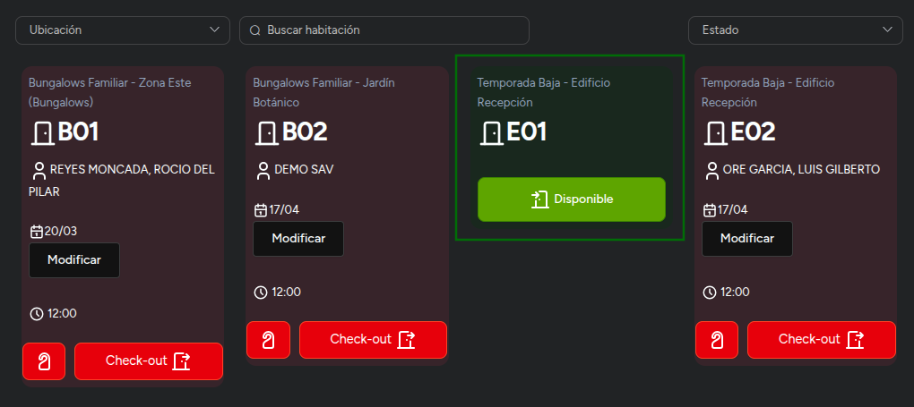

🔟 Facturación consolidada (extra clave)

Si el cliente solicita una factura por todo lo consumido:
Puedes ir a **Notas de venta**
Y generar un comprobante desde múltiples notas de venta 🧾

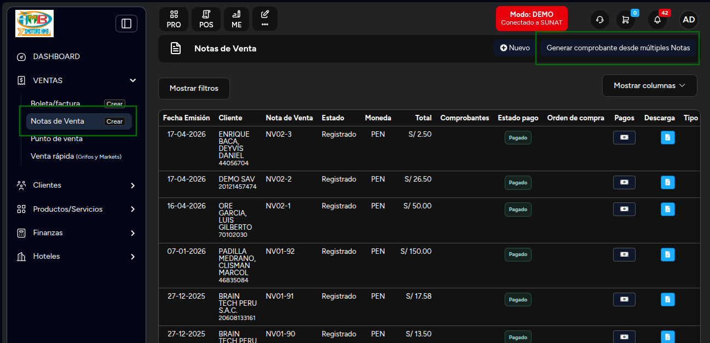

💡 Con este flujo puedes gestionar todo el ciclo del huésped: desde el ingreso hasta la facturación
