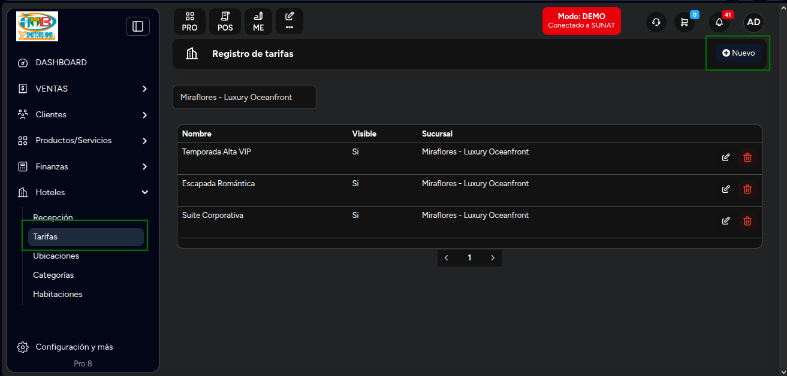
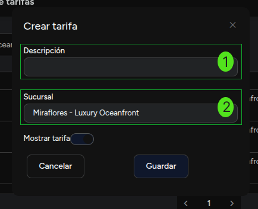
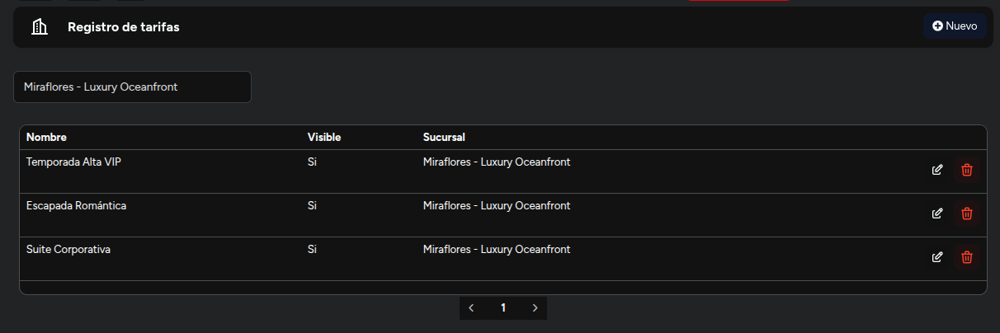

# Tarifas

En este artículo te enseñaremos a crear tarifas para tus habitaciones. Sigue estos pasos para realizarlo:

Ingresa al módulo de **Hoteles** y luego selecciona la subcategoría **Tarifas**.

## Crear tarifas

En la parte superior derecha selecciona el botón Nuevo. Aparecerá el siguiente formulario:

Completa:

1. **Descripción:** Inserta la descripción de la tarifa.
2. **Sucursal:** Selecciona la sucursal, donde se aplicará la tarifa.

Por ultimo en el modal habla un toggle para indicar si la tarifa estara activa o no. Por defecto estara activa.

Seguido selecciona el botón **Guardar**.

Se mostrará el **Registro de tarifas:**

## Acciones

En el registro de tarifas podrás realizar las siguientes acciones:

1. **Editar:** Selecciona el botón de editar para modificar la tarifa.
2. **Eliminar:** Selecciona el botón de eliminar para eliminar la tarifa.

