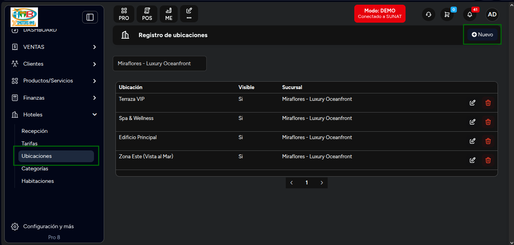
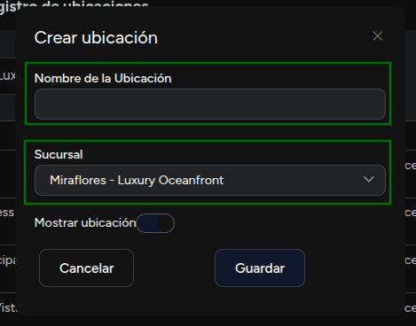
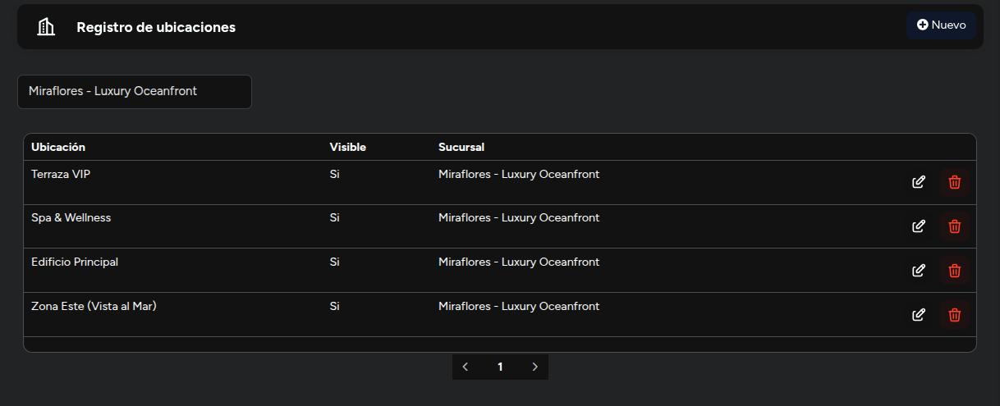

# Ubicaciones

En este artículo te enseñaremos a como crear ubicaciones. Sigue estos pasos para realizarlo:

Ingresa al módulo de **Hoteles** y luego selecciona la subcategoría **Ubicaciones**.

## Crear ubicaciones

En la parte superior derecha selecciona el botón **Nuevo**. Aparecerá el siguiente formulario:

Completa:

1. **Nombre:** Inserta el nombre de la ubicación.
2. **Sucursal:** Selecciona la sucursal, donde se aplicará la ubicación.
3. **Estado:** Selecciona el interruptor si desea mostrar la ubicación. Por defecto estará activa.

Seguido selecciona el botón **Guardar**.

Se mostrará el listado de ubicaciones:

Podrá editar la ubicación, seleccionando el icono del lápiz, y eliminarla con el icono de la papelera.
