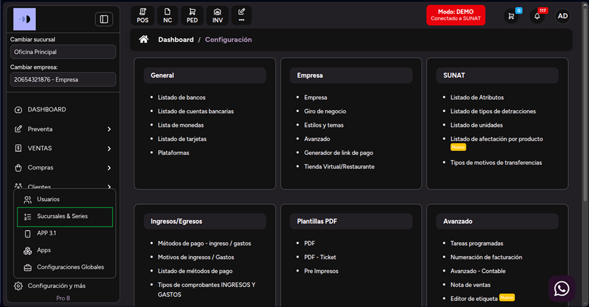
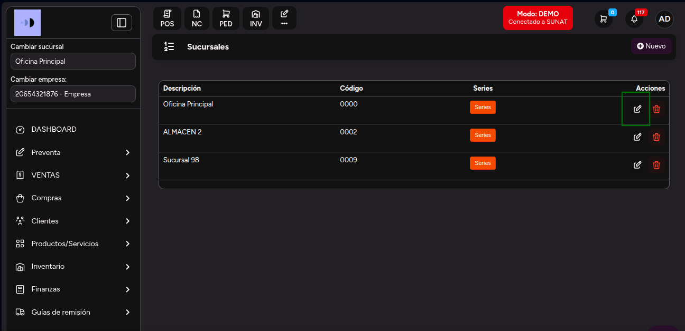
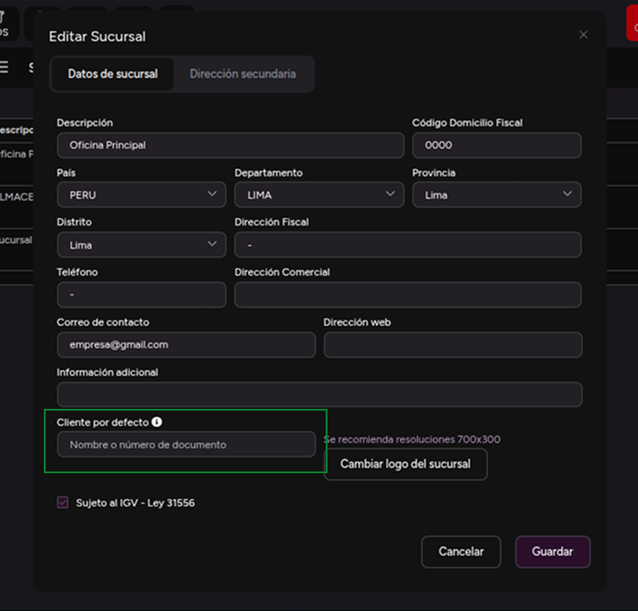
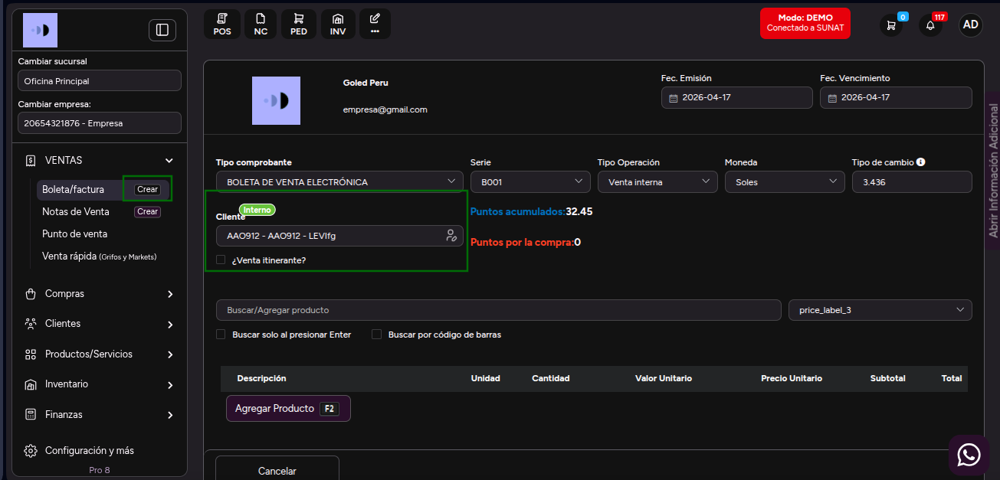

# ¿Cómo elegir un cliente por defecto?

En este apartado aprenderás a configurar un **cliente por defecto** para agilizar la creación de comprobantes en el módulo de Ventas. De esta manera, al generar un **Nuevo Comprobante**, el cliente configurado se cargará automáticamente.

---

## 1. Ir a "Sucursales y Series"

1. Desde el menú principal, dirígete a **Configuración y más**.  
2. Selecciona la subcategoría **Sucursales y Series**.

---

## 2. Editar una sucursal

1. Haz clic en el botón **Editar** el icono de lapiz de la sucursal que deseas modificar.

2. Se abrirá el modal de **Editar Sucursal**.

---

## 3. Configurar el "Cliente por defecto"

1. Localiza la opción **Cliente por defecto**.

2. Selecciona el cliente que deseas que se cargue automáticamente en tus comprobantes.

> **Nota:** Asegúrate de que el cliente que quieres usar como defecto ya exista en el sistema.

---

## 4. Verificar en el módulo de Ventas

1. Dirígete al módulo **Ventas**.
2. Selecciona el submódulo **Boleta / Factura** o haz clic en el botón **Crear**.
3. Verás que el **cliente por defecto** elegido en la configuración de sucursales se cargará de manera automática al crear un nuevo comprobante.

