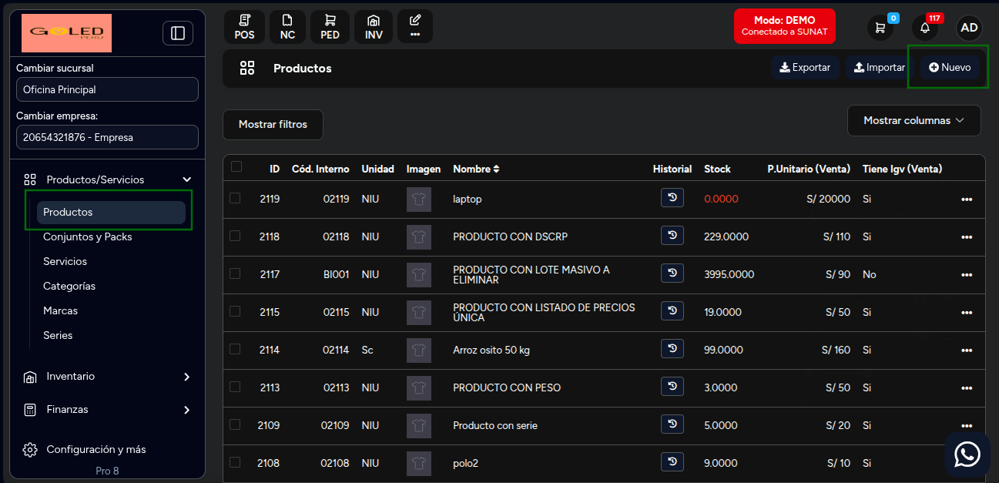
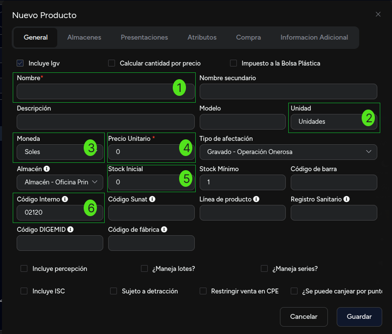
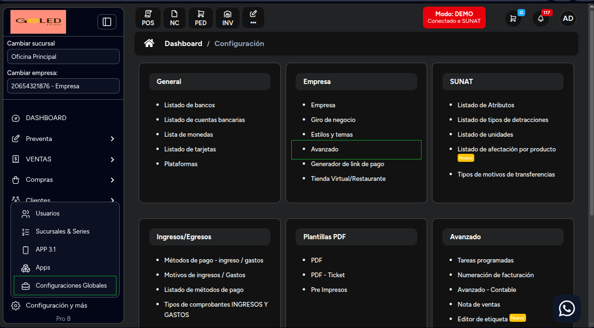
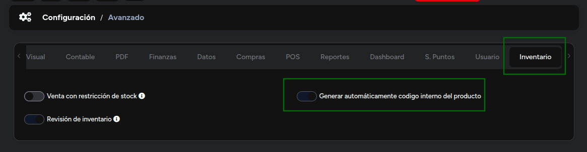

# Creación básica

En esta área te mostraremos cómo crear productos de una manera sencilla. Sigue estos pasos para realizarlo:

## Crear producto

Ingresa al módulo de **Productos/Servicios** y luego selecciona subcategoría **Productos**.
En la parte superior derecha selecciona el botón **Nuevo**.

Posteriormente aparecerá el formulario para llenar los datos del **Nuevo producto.**

 

 Se procederá a ingresar los siguientes datos:

**1.  Nombre:** Ingresa el nombre del producto.

**2.  Unidad:** Selecciona las unidades que se amolden a su servicio.

**3.  Moneda:** Selecciona si desea que el pago del producto sea en soles o dólares.

**4.  Precio unitario:** Ingresa el precio del producto.

**5.  Stock inicial:** Ingresa la cantidad de unidades del producto.

**6.  Código interno:** Identifica el producto, ayuda a la gestión de inventarios.Es importante colocar el código interno para que los productos puedan visualizarse en su Tienda Virtual.

:::danger IMPORTANTE:
Si no cuenta con un código interno en su empresa, puede configurar para que se asignen automáticamente desde el módulo **Configuraciones Globales** en la sección **Empresa** y la subcategoria **Avanzado**.

Posteriormente en la seccion de **Avanzado**, vaya todo hacia la derecha y ubicara la opcion de **Inventario** y habilite la opcion de **Generar automaticamente codigo interno en productos**

:::

:::danger IMPORTANTE:

Seleccion del **Tipo de Afectación al IGV**: Es importante que seleccione el tipo de afectación del IGV, ya que esto determinará cómo se calculará el impuesto en sus facturas y boletas.
:::