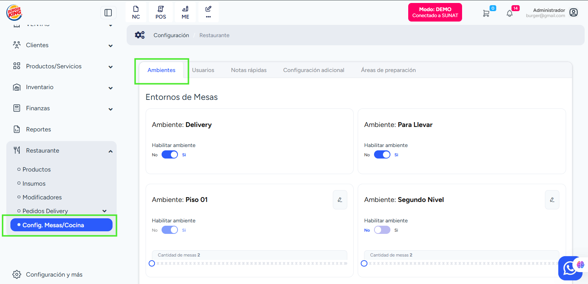
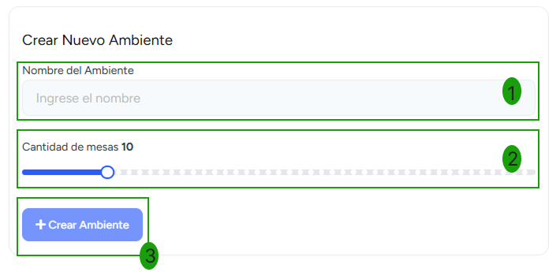

# Configuración de Ambientes

En esta sección puedes configurar la estructura de atención del restaurante, definendo los ambientes donde se gestionan los pedidos.

Para ingresar a ambientes, dirígete al módulo **Restaurante → Config. Mesas / Cocina → Ambientes**.

Desde la sección **Ambientes** se puede:

- **Habilitar o deshabilitar ambientes**
- **Configurar la cantidad de mesas por ambiente**
- **Editar los nombres de los ambientes**: Permite ajustar los nombres de cada uno de los espacios (ej. Salón, Terraza, Patio).
- **Crear nuevos ambientes**:

1.  Ingresa el **Nombre del ambiente**.
2.  Define la **Cantidad de mesas**.
3.  Selecciona el botón **Crear Ambiente**.
