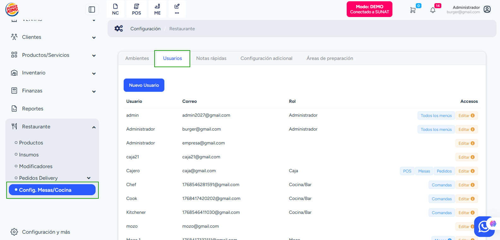

# Gestión de Usuarios

En esta sección se gestionan las personas que utilizarán Mozo, como administradores, cajeros, mozos y personal de cocina. Aquí se define quién puede ingresar al sistema y a qué funciones tiene acceso.

Para ingresar, dirígete al módulo **Restaurante → Config. Mesas / Cocina → Usuarios**.

## Crear un Usuario

Para crear un usuario, selecciona el botón **Nuevo Usuario** y completa la siguiente información:

1.  **Tipo de Usuario (Rol)**: Selecciona el rol según la función que tendrá en el sistema. El rol define qué partes del sistema podrá ver y utilizar.
    - **Administrador**: Acceso completo a todas las funciones.
    - **Caja**: Acceso a funciones de cobro y cierre de caja.
    - **Mozo**: Acceso a la toma de pedidos y gestión de mesas.
    - **Cocina / Bar**: Acceso a la visualización de comandas.

2.  **Nombre**: Ingresa el nombre con el que el usuario será identificado dentro del sistema (ej. "Juan - Mozo").

3.  **PIN de Acceso**: Crea un código numérico que el usuario utilizará para ingresar al sistema. Este código debe ser fácil de recordar pero seguro.

4.  **Guardar**: Presiona el botón para completar la creación del usuario.

:::caution Alerta Importante
Si necesitas asignar permisos avanzados o accesos adicionales relacionados con el sistema de facturación, estos se gestionan desde el módulo de usuarios del **sistema principal**, no desde esta vista rápida de Mozo.
:::
