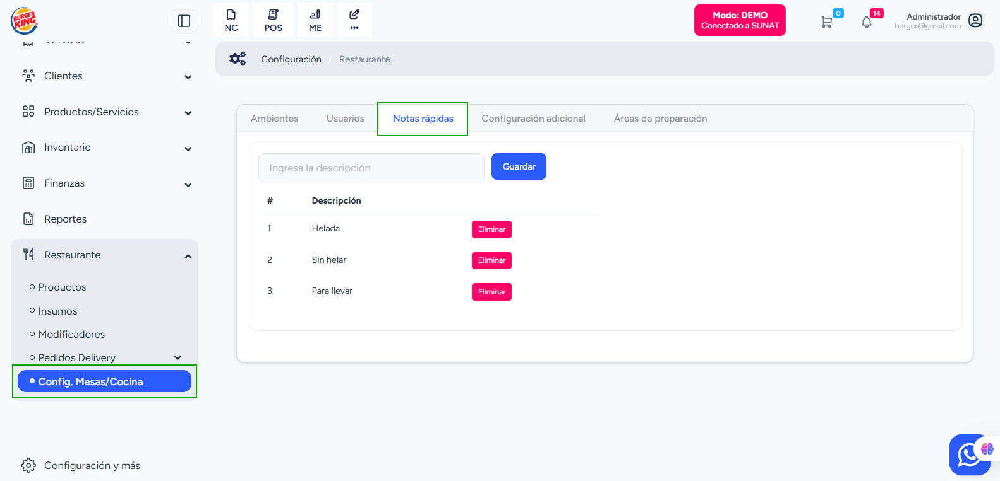

# Notas Rápidas

En esta sección se configuran las **notas rápidas** que podrán seleccionarse al tomar pedidos. Estas notas se muestran directamente en las comandas, permitiendo enviar indicaciones claras a cocina o barra (ej. "Sin sal", "Bien cocido").

**Ubicación:**
📍 **Restaurante → Config. Mesas / Cocina → Notas rápidas**

Las notas rápidas se utilizan para indicar preferencias o instrucciones especiales sobre un pedido. Ejemplos comunes incluyen:

- Helada / Sin helar
- Sin azúcar
- Para llevar
- Término de la carne

## Crear una Nota Rápida

Para agregar una nueva nota:

1.  Ingresa la descripción de la nota en el campo correspondiente (ej. `Sin hielo`).
2.  Selecciona el botón **Guardar**.
3.  La nota quedará disponible para su uso inmediato en los pedidos.

## Eliminar una Nota Rápida

Si ya no necesitas una nota, puedes eliminarla fácilmente:

1.  En el listado de notas, busca la nota que deseas quitar.
2.  Selecciona el botón **Eliminar**.
3.  La nota dejará de aparecer en las opciones de las comandas.
