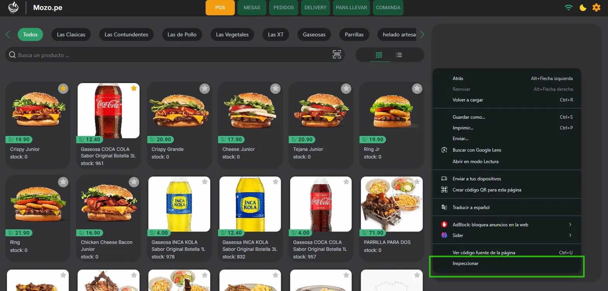
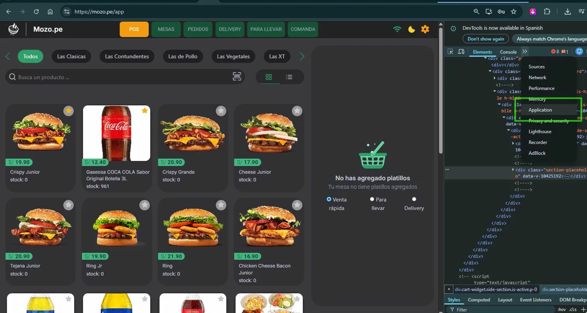
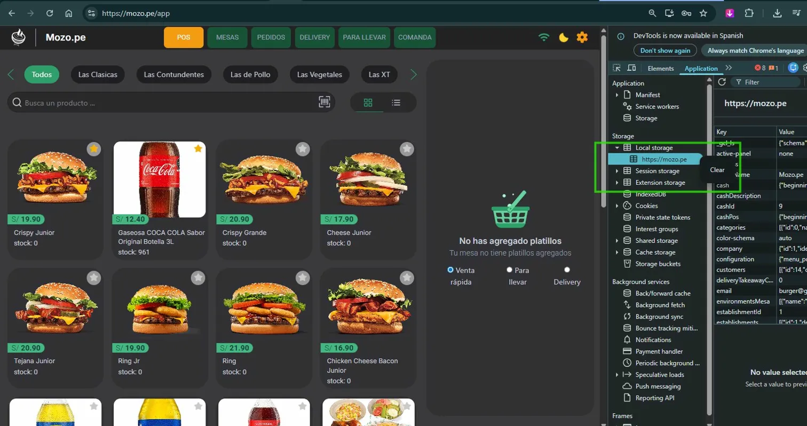
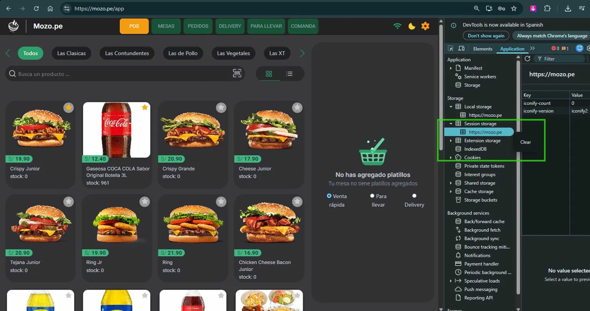

# Cómo Limpiar Local Storage y Session Storage

Esta guía te muestra cómo limpiar el almacenamiento local (Local Storage) y el almacenamiento de sesión (Session Storage) de Mozo.pe usando las herramientas de desarrollo del navegador.

## Paso 1: Abrir el Inspector

Haz **click derecho** en cualquier parte de la página web y selecciona **"Inspeccionar"** en el menú contextual.

## Paso 2: Ir a la Pestaña Application

1. En las herramientas de desarrollo, selecciona la pestaña **"Application"** (Aplicación)

2. En el panel izquierdo, despliega la sección **"Storage"**
3. Busca y selecciona **"Local storage"**
4. Haz click derecho sobre el dominio (por ejemplo: `https://mozo.pe`)
5. Selecciona **"Clear"** para limpiar todo el Local Storage

## Paso 3: Limpiar Session Storage

1. En el mismo panel de **"Application"**
2. Busca y selecciona **"Session storage"**
3. Haz click derecho sobre el dominio
4. Selecciona **"Clear"** para limpiar todo el Session Storage

## Resultado

Después de completar estos pasos, tanto el Local Storage como el Session Storage habrán sido limpiados. Esto puede ser útil para:

- Resolver problemas de caché
- Limpiar datos de sesión corruptos
- Reiniciar la aplicación a un estado limpio
- Solucionar errores relacionados con datos almacenados localmente

## Notas Importantes

- **Local Storage**: Los datos persisten incluso después de cerrar el navegador
- **Session Storage**: Los datos se eliminan automáticamente al cerrar la pestaña o el navegador
- Al limpiar estos almacenamientos, es posible que necesites volver a iniciar sesión en la aplicación
